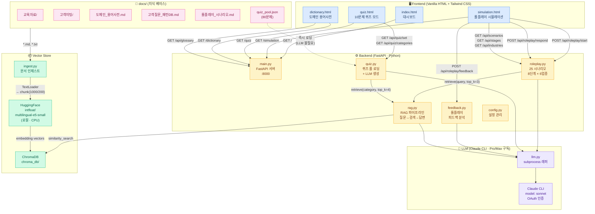
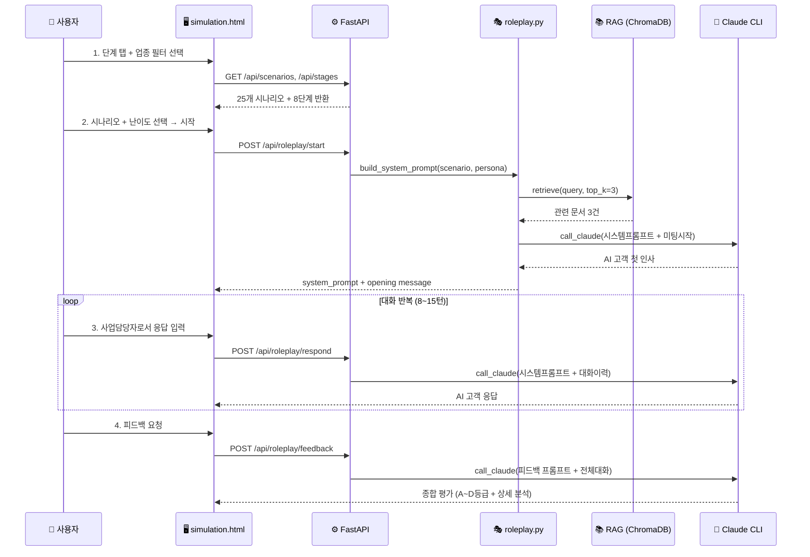
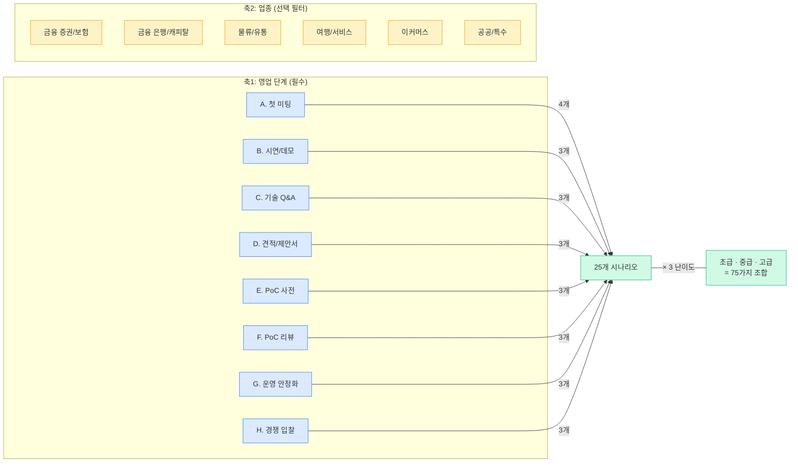

# AICC Meeting Simulator — 회의록

## 안건 목록

- [ ] 사전컨설팅 WBS
- [ ] 파트너사 TMM 후보
- [ ] PQ 진행현황
- [ ] 상담어드바이저 아웃소싱사 분석 (기능별 상세) 회의
- [ ] News PRD → 최종우님
- [ ] C Agent Module → Github Push (배홍주님)
- [ ] 견적표준화를 위한 논의 (견적서 모음)
- [ ] AICC_Meeting_Simulator

---

## AICC Meeting Simulator — 아키텍처 구성도

### 전체 시스템 아키텍처

### 데이터 플로우 (롤플레이 시뮬레이션)

### 기술 스택 요약

| 레이어 | 기술 | 비고 |
|--------|------|------|
| **Frontend** | Vanilla HTML + Tailwind CSS + JS | SPA (단일 페이지) |
| **Backend** | FastAPI (Python) | uvicorn, port 8000 |
| **LLM** | Claude CLI (sonnet) | Pro/Max 구독 OAuth · API Key 불필요 |
| **Embedding** | intfloat/multilingual-e5-small | HuggingFace · 로컬 CPU |
| **Vector DB** | ChromaDB | 로컬 저장 (chroma_db/) |
| **RAG** | LangChain | chunk 1000/200, top_k=5 |
| **데이터** | 170+ 실제 미팅 트랜스크립트 | Discord → docs/ |

### 시나리오 매트릭스

> **GitHub:** https://github.com/aiccbiz2/aicc_meeting_simulator (private)
> **실행:** `python main.py` → http://localhost:8000

